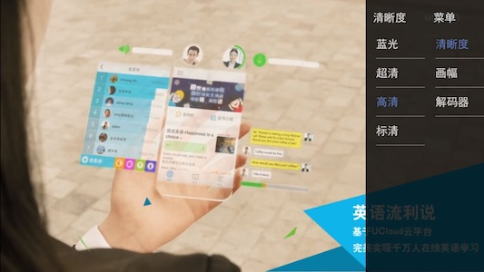
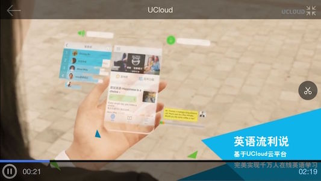

# [UCloud MediaPlayer iOS SDK]()

UCDMediaPlayer 是一个适用于 iOS 的音视频播放器 SDK，基于FFmpeg自主研发音视频媒体播放器，支持 RTMP, HTTP-FLV 和 HLS 直播流媒体播放。



## 一. 功能特性
- [x] 支持 RTMP、HLS、HTTP-FLV、RTSP 等协议
- [x] 支持累积延迟消除(RTMP和HTTP+FLV)，降低观看直播的观众延迟
- [x] 支持H.265/HEVC播放
- [x] 包含armv7、arm64、i386、x86_64指令集
- [x] 支持直播首屏秒开
- [x] 支持直播、点播播放
- [x] 支持软解、硬解切换
- [x] 支持点播多清晰度切换
- [x] 支持画幅调整
- [x] 支持全屏、非全屏切换
- [x] 支持屏幕亮度调节
- [x] 支持音量调节
- [x] 支持播放进度拖拽操作

## 二. 集成介绍
### 2.1 系统要求
* 最低支持iOS版本：iOS 7.0
* 最低支持iPhone型号：iPhone 4
* 支持CPU架构： armv7,arm64(和i386,x86_64模拟器) 

### 2.2 下载集成
```
git clone https://github.com/umdk/UCDMediaPlayer_iOS.git
```

目录结构：  
- demo	: UCDMediaPlayer演示demo，展示本SDK的主要接口使用  
- docs/docset : appleDoc风格接口文档，安装后可在Xcode中直接查看，亦可在Dash APP上查看使用  
- docs/html : appleDoc风格网页版接口文档，可直接点击index.html查看  
- lib/Player : 播放器静态库和相关头文件
- PlayerUI : 播放器UI及其管理器类，用户可自行修改使用

### 2.3 基础集成
#### 2.3.1 导入静态库

将lib文件夹下的Player直接拉到Xcode的工程中；

*Player文件夹中相关文件意义:  

| 类文件 | 描述 |
|---|---|---|
| UCloudMediaPlayer.h | 播放器控制类 |
| UCloudMediaPlayback.h | 播放器通知类 |
| libUCloudMediaPlayer.a | 播放器静态库 |
| UCloudPlayback.h | 播放器播放类 |
| UCloudMediaModule.h | 播放器显示控制类 |

#### 2.3.2 依赖库说明 

 添加libUCloudMediaPlayer.a所需引用的系统 framework,如下: 
 
| framework |
|---|---|
| VideoToolbox.framework |
| CoreMedia.framework |
| AVFoundation.framework |
| AudioToolbox.framework |
| libz.tbd |

#### 2.3.3 iOS9中ATS配置

由于iOS9引入了AppTransportSecurity(ATS)特性，要求App访问的网络使用HTTPS协议，如果不做特殊设置，http请求会失败，所以需要开发者在工程中增加设置以便可以发送http请求，如下：

在info plist中增加字段：

\< key\>NSAppTransportSecurity\< /key\>

\< dict\>

 \< key\>NSAllowsArbitraryLoads\< /key\>

 \< true\>

\< /dict\>

### 2.4播放器接入

#### 2.4.1 引入静态库

播放器包含ffmpeg库，已知在含有ffmpeg的第三方库情况下无法正常运行,可以尝试在编译选项**Other linker Flags**中加入**-force_load**来解决冲突，但不推荐使用。Player文件夹放置的是直播云播放器库，（如果已经有播放器库，可以不添加，自行配置播放器）将Player直接拉进Xcode工程目录中

*Player文件夹中相关文件意义:

| 类文件 | 描述 |
|---|---|---|
| UCloudMediaPlayer.h | 播放器控制类 |
| UCloudMediaPlayback.h | 播放器通知类 |
| libUCloudMediaPlayer.a | 播放器静态库 |
| UCloudPlayback.h | 播放器播放类 |
| UCloudMediaModule.h | 播放器显示控制类 |
| Filter文件夹 | 所有滤镜库，包含美颜滤镜 |


*引入**PlayerUI**，**PlayerUI**是项目中的播放器UI及其管理器类，用户可以自行修改使用。

#### 2.4.2 集成播放器

##### 2.4.2.1 引入头文件
```
#import "UCloudMediaPlayer.h"
#import "UCloudMediaViewController.h"
#import "PlayerManager.h"
```
##### 2.4.2.2 开始播放直播流
```
self.playerManager = [[PlayerManager alloc] init];
self.playerManager.view = self.view;
self.playerManager.viewContorller = self;
[self.playerManager setPortraitViewHeight: self.view.frame.size.height];
[self.playerManager buildMediaPlayer:self.pathTextField.text];
```
##### 2.4.2.3 关闭播放器
```
[self.playerManager.mediaPlayer.player.view removeFromSuperview];
[self.playerManager.controlVC.view removeFromSuperview];
[self.playerManager.mediaPlayer.player shutdown];
self.playerManager.mediaPlayer = nil;
```
## 三 使用进阶

### 3.1 参数配置
当你要深入理解 SDK 的一些参数及有定制化需求时，可以从高级功能部分中查询阅读。

<code>defaultDecodeMethod</code>
解码方式分软解码和硬解码

<code>UrlType</code> 播放地址类型，区分为本地视频，网络视频，直播视频，使用UrlTypeAuto程序会根据相关规则为你选择播放类型，如果是http-flv直播，请必须设置为UrlTypeLive，hls点播必须设置为UrlTypeHttp;

<code>currentPlaybackTime</code> 当前播放时间点；

<code>duration</code> 视频总时间；

<code>playableDuration</code> 媒体可播放时长，主要用于表示网络媒体已下载视频时长

<code>bufferingProgress</code> 视频缓冲进度；

<code>isPreparedToPlay</code> 是否准备好可以播放

<code>playbackState</code> 媒体播放状态；

<code>loadState</code> 网络媒体加载状态

<code>shouldAutoplay</code> 是否自动播放

## 四 API介绍

### 4.1 主要方法
UCloudMediaPlayer.h  

```
/**
 *  初始化mediaPlayer
 *
 *  @return UCloudMediaPlayer
 */
+ (instancetype)ucloudMediaPlayer;

/**
 *  配置播放view
 *
 *  @param url   播放url
 *  @param urltype 播放类型
 *  @param frame playerView视图大小，默认传入CGRectNull
 *  @param view  player
 *  @param block 初始化完成
 */
- (void)showMediaPlayer:(NSString *)url urltype:(UrlType)urltype frame:(CGRect)frame view:(UIView *)view completion:(UCloudMediaCompletionBlock)block;

/**
 *  配置播放view
 *
 *  @param view  父view
 *  @param block 回掉清晰度信息
 */
- (void)showInview:(UIView *)view definition:(void(^)(NSInteger defaultNum, NSArray *data))block;

/**
 *  切换解码方式
 *
 *  @param decode 切换后的解码方式
 */
- (void)selectDecodeMthod:(DecodeMthod)decode;

/**
 *  切换清晰度
 *
 *  @param definition 切换后的清晰度
 */
- (void)selectDefinition:(Definition)definition;

/**
 *  刷新视图
 */
- (void)refreshView;
```
UCloudPlayback.h

```
/**
 *  准备播放
 */
- (void)prepareToPlay;

/**
 *  播放
 */
- (void)play;

/**
 *  暂停
 */
- (void)pause;

/**
 *  停止
 */
- (void)stop;

/**
 *  播放状态
 */
- (BOOL)isPlaying;

/**
 *  关闭播放器
 */
- (void)shutdown;

/**
 *  进入后台自动暂停
 *
 *  @param pause 是否暂停
 */
- (void)setPauseInBackground:(BOOL)pause;
```

### 4.4 枚举 
```
typedef NS_ENUM(NSInteger, DecodeMthod)
{
    DecodeMthodSoft,//软解
    DecodeMthodHard,//硬解
};

typedef NS_ENUM(NSInteger, Definition)
{
    Definition_fhd,   //@"蓝光"
    Definition_shd,   //@"超清"
    Definition_hd,    //@"高清"
    Definition_sd,    //@"标清"
};

typedef NS_ENUM(NSInteger, ErrorNum)
{
    ErrorNumShowViewIsNull = 1000,
    ErrorNumUrlIsNull,
    ErrorNumSaveShotError,
    ErrorNumUrlIsWrong,
    ErrorNumdrm,
    
    ErrorNumCgiLostPars = 40021,
    ErrorNumCgiRequest = 40022,
    ErrorNumCgiAuthFail = 40023,
    ErrorNumCgiMovieCannotFound = 40024,//不会构建videoview
    ErrorNumCgiDomainError = 40025,
    ErrorNumCgiServerError = 40026,
    ErrorNumCgiTimeOut = 40027,
};

typedef NS_ENUM(NSInteger, UrlType)
{
    UrlTypeAuto   = 0,//自动，程序会根据相关规则为你选择播放类型，如果是http-flv直播，请必须设置为UrlTypeLive，hls点播必须设置为UrlTypeHttp
    UrlTypeLocal  = 1,//本地视频
    UrlTypeHttp   = 2,//网络视频(非直播)
    UrlTypeLive   = 3,//直播
};
```
## 五 SDK升级历史信息文档变更

| 版本号 | 发布日期 | 说明 |
|---|---|---|
| 1.2.4  | 2016.9.18  | 增加对FCSubscribe指令播放支持 |
| 1.2.3  | 2016.9.8  | 区分直播与点播的hls播放方式；hls播放流畅度优化 |
| 1.2.2  | 2016.7.29 | 优化弱网下音频播放体验 |
| 1.2.1  | 2016.7.27 | 优化直播追赶策略，使主动丢帧时声音更自然 |
| 1.2.0  | 2016.7.11 | 增加直播延迟丢帧效果，修复弱网情况下音效消失的问题 |
| 1.1.12 | 2016.5.16 | 1、修复鉴权失败时约束更新crash的问题(playerManager.m)；<br/>2、showMediaPlayer方法增加了urltype参数，每次重新播放时必须传入播放类型，以此解决使用单例模式下直播与点播来回切换状态相关没有重置的问题；<br/>3、头文件UCloudMediaPlayer.h中的UrlType枚举UrlTypeUnkown改为UrlTypeAuto |
| 1.1.11 | 2016.5.4 | 更新libUCloudMediaPlayer.a（修改了播放api、优化对蓝牙设备、扬声器、耳机之间的处理）；重新调整了demo初始状态的画幅设置；新增播放器创建方式 |
| 1.1.10 | 2016.4.29 | 修复弱网下偶现播放crash的bug；调整了播放器的初始化方式 |
| 1.1.9  | 2016.4.26 | 修改部分类与变量的命名 |
| 1.1    | 2016.2.19 | 播放器UI剥离 |
| 1.0    | 2016.1.23 | 优化推流时打开摄像头的流程；增加直播推流的模拟器库版本 |
| 0.9.1  | 2015.10.15 | 完成drm功能开发 |
| 0.9.0  | 2015.9.18 | 基本功能完成，UI编写使用完毕，文档初稿 |

## 六 反馈和建议
  - 主 页：<https://www.ucloud.cn/>
  - issue：[查看已有的 issues 和提交 Bug[推荐]](https://github.com/umdk/UCDMediaPlayer_iOS/issues)
  - 邮 箱：[sdk_spt@ucloud.cn](mailto:sdk_spt@ucloud.cn)
 
### 问题反馈参考模板

| 名称 | 描述 |
|---|---|
| SDK名称 | UCDMediaPlayer_iOS|
| 设备型号 | iphone7 |
| 系统版本 | iOS 10 |
| SDK版本 | v1.5.0 |
| 问题描述 | 描述问题现象 |
| 操作路径 | 经过了什么样的操作出现所述的问题 |
| 附 件 | 文本形式控制台log、crash报告、其他辅助信息（播放界面截屏或其他） |
